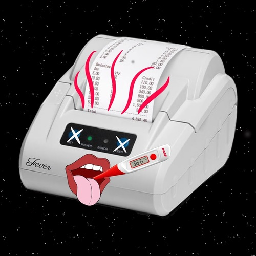

# Fever


Simple Thermal-printing Server using Python FastAPI and escpos libraries.



You can support this project by owning [this NFT](https://opensea.io/assets/0x60f80121c31a0d46b5279700f9df786054aa5ee5/273290) (Non-fungible Token).

## Run server

### Python
Install Python dependencies and execute `make run`.
```
$ pip install -U pip
$ pip install -r requirements.txt
$ FEVER_SERVER_HOST=0.0.0.0 FEVER_PRINTER_FILE=/dev/usb/lp1 make run
```

### Docker
You can start `fever` server using docker.
Run the command below:
```
$ docker run --rm --name fever \
         -p 12345:12345 \
         -v /dev/usb/lp1:/host-lp \
         -e FEVER_SERVER_HOST=0.0.0.0 \
         -e FEVER_PRINTER_FILE=/host-lp \
         -it azurelysium/fever:latest
```
